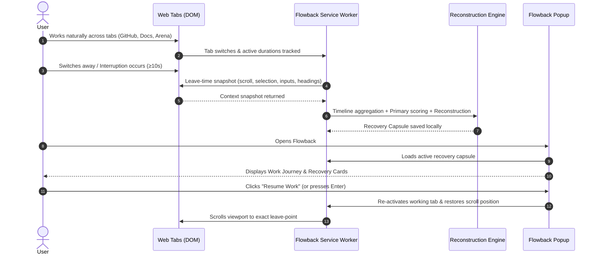
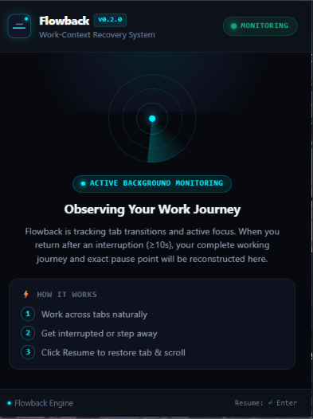
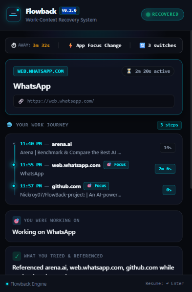

# Flowback

### Capture your train of thought. Resume instantly. No context lost.

Flowback is an AI-powered Work-Context Recovery System that observes your working journey across tabs, detects meaningful interruptions, reconstructs the context you were working in, and helps you resume from the exact point where your work stopped.

---

```
  🧠 Deep Work            ⚡ Interruption            🔄 Reconstruction           🎯 Instant Resume
[Multi-Tab Flow]  ───▶  [Tab Switch / Away]  ───▶  [Journey + State + Next]  ───▶  [Focus Tab & Scroll]
```

---

## 1. The Problem

Modern knowledge work is fragmented across dozens of open tabs: GitHub repositories, technical documentation, AI playgrounds, pull requests, issue trackers, and team messaging apps.

```
                  ┌─────────────────────────────────────────────────────────┐
                  │                 The Cognitive Reload Penalty            │
                  ├─────────────────────────────────────────────────────────┤
                  │  ⚡ Ping / Interruption occurs                          │
                  │  ⏳ 3 minutes answering a notification                  │
                  │  ❓ Return to browser: "What was I trying to solve?"     │
                  │  🔍 5–15 minutes clicking open tabs, re-reading code    │
                  └─────────────────────────────────────────────────────────┘
```

The real cost of an interruption is not the time spent away—**it is the mental effort required to reconstruct context upon return**. 

When context collapses, you have to mentally rebuild:
- *What specific goal was I pursuing?*
- *Which references and documentation sections did I just inspect?*
- *Where exactly did I pause typing or reading?*
- *What is the immediate, concrete next action I need to take?*

Traditional browser history only tracks URLs. It remembers **where you clicked**, but forgets **what you were thinking**.

---

## 2. The Flowback Solution

Flowback acts as an intelligent **work-context recovery layer** for your browser. It continuously aggregates a lightweight timeline of your active sessions, captures the exact state of your working tab at the moment you leave, and reconstructs your train of thought.

| Dimension | Traditional Browser History | Flowback Recovery System |
|---|---|---|
| **Core Question** | *"What URLs did I visit?"* | *"What was I working on and why?"* |
| **Data Scope** | Flat list of page titles & links | Structured timeline with durations & return visits |
| **State Capture** | None (static URL only) | Headings, selected text, draft inputs, scroll position |
| **Interruption Detection** | None | Automatic detection on $\ge 10\text{s}$ away or focus switches |
| **Recovery Intelligence** | None | Synthesizes **Task**, **Tried**, **Where Left Off**, **Next Action** |
| **Resumption** | Opens a blank new tab | Re-activates exact tab, focuses window, and restores scroll |
| **AI Requirement** | N/A | **100% functional offline** (Deterministic + Optional AI) |

---

## 3. How It Works



1. **Work Naturally**: You navigate between documentation, codebases, and references.
2. **Observe**: Flowback logs duration per tab, filters rapid noise (<1.5s), and tracks workflow return patterns.
3. **Capture on Leave**: When you switch tabs or blur the browser window, Flowback captures an instant leave-time snapshot (selected text, form drafts, headings, and viewport coordinates).
4. **Reconstruct & Resume**: When an interruption ($\ge 10\text{s}$) is confirmed, Flowback reconstructs your working journey. One click on **Resume Work** restores your exact working tab and scroll position.

---

## 4. Product Experience

Flowback's interface is built on an **obsidian dark glassmorphic design system** with electric neon accents, designed to deliver complete situational awareness in under 5 seconds.

### Key Interface Modules

- **Pulsing Live Status Beacon**: Indicates real-time extension state (`MONITORING`, `RECOVERED`, `RESTORING…`, `RESTORED`).
- **Interruption Telemetry Strip**: Displays exact away duration (`⏱ AWAY: 3m 32s`), the interruption trigger reason (`⚡ App Focus Change` / `Tab Switch`), and count of meaningful transitions (`🔄 3 switches`).
- **Hero Target Card**: Displays the primary workspace domain, active time spent, page title, and sanitized deep-link URL.
- **Work Journey Timeline**: Chronological steps displaying time-of-day badges (`11:40 PM`), domain tags, active duration pills, and badges for return visits (`↩ Return`) and primary focus (`🎯 Focus`).
- **Recovery Grid**:
  - 🎯 **YOU WERE WORKING ON**: High-level intent derived from inputs, PRs, headings, and journey citations.
  - ✓ **WHAT YOU TRIED & REFERENCED**: Aggregated multi-tab references and drafted inputs.
  - 🚧 **WHERE YOU LEFT OFF**: Concrete pre-interruption state (e.g. typing in field, reading section at scroll depth).
  - ⚡ **RECOMMENDED NEXT STEP**: Actionable, evidence-grounded next step (no generic filler text).
- **One-Click & Keyboard Resumption**: Instant workspace restore via the **Resume Work** button or pressing `↵ Enter`.

---

## 5. Visual Walkthrough & Screenshots

### A. Active Background Monitoring State
When working normally, Flowback runs quietly in the background, monitoring tab transitions and active focus without interrupting your workflow.

<p align="center">
  
  <br />
  <em>Flowback actively tracking sessions with radar telemetry and step-by-step guidance.</em>
</p>

---

### B. The Reconstructed Work Journey
When returning from an interruption, Flowback reconstructs the sequence of tabs visited, time spent per page, and identifies workflow returns.

<p align="center">
  
  <br />
  <em>Chronological timeline showing multi-tab transitions, focus indicators, and time spent.</em>
</p>

---

### C. Context Recovery & Resumption
Flowback provides a structured recovery summary answering what you were doing, what you tried, where you stopped, and what to do next.

<p align="center">
  
  <br />
  <em>Evidence-grounded recovery cards with one-click workspace and scroll restoration.</em>
</p>

---

## 6. Key Features

| Feature | Description | Implementation Status |
|---|---|:---:|
| **Work Journey Timeline** | Chronological timeline tracking tab transitions, timestamps, and active durations. | ✅ Verified |
| **Interruption Telemetry** | Detects interruptions $\ge 10\text{s}$ away, classifies reason (tab switch, window blur). | ✅ Verified |
| **Leave-Time DOM Snapshot** | Captures page headings, text selections, active form inputs, and scroll coordinates. | ✅ Verified |
| **Deterministic Scoring** | Multi-factor algorithm identifying primary work context from time, returns, and recency. | ✅ Verified |
| **Scroll Position Preservation** | Restores exact viewport `scrollX`/`scrollY` positions upon clicking Resume. | ✅ Verified |
| **Title & Noise Sanitization** | Automatically strips notification badges (`(9) WhatsApp` $\rightarrow$ `WhatsApp`) and platform noise. | ✅ Verified |
| **Secret & Token Redaction** | Automatically masks JWTs, bearer tokens, API keys, and sensitive auth query params. | ✅ Verified |
| **100% Offline Core** | Fully functional deterministic reconstruction engine requiring zero API keys or external services. | ✅ Verified |
| **Optional AI Enrichment** | Server-side Gemini / OpenAI integration with strict schema validation and deterministic fallback. | ✅ Verified |
| **Keyboard Accessibility** | Full keyboard support: `↵ Enter` to Resume Work, `Esc` to Dismiss. | ✅ Verified |

---

## 7. Technical Architecture

```
FlowBack-project/
├── ai/
│   ├── context.js          # Core context processing, sanitization, timeline & deterministic engine
│   └── prompt.js           # AI system prompt specifications & schema constraints
├── backend/
│   ├── ai.js               # AI provider integration (OpenAI / Gemini / Custom LLM)
│   ├── server.js           # Lightweight Express API backend for optional AI reconstruction
│   ├── test.js             # Automated 16-suite test runner & validation pipeline
│   └── package.json        # Backend dependencies & scripts
├── docs/
│   ├── architecture.md     # Detailed engineering specifications
│   ├── demo.md             # Judge & reviewer demo script
│   └── images/             # Product screenshots & visual assets
├── extension/
│   ├── background.js       # Manifest V3 service worker & session timeline engine
│   ├── content.js          # Isolated content script for DOM & scroll capture/restore
│   ├── manifest.json       # Chrome Extension Manifest V3 configuration
│   └── popup/
│       ├── popup.html      # Cyber glassmorphic layout & semantic UI components
│       ├── popup.css       # Obsidian dark theme, animations & custom scrollbars
│       └── popup.js        # UI controller, telemetry binding & keyboard shortcuts
└── README.md
```

### Architectural Data Flow

```
┌───────────────────────────┐     Leave-Time Snapshot     ┌───────────────────────────┐
│     Active Web Page       │ ──────────────────────────▶ │   extension/content.js    │
│  (DOM, Forms, Scroll Y)   │ ◀────────────────────────── │  (Promise race, 600ms)    │
└───────────────────────────┘       Restore Scroll        └─────────────┬─────────────┘
                                                                        │
                                                                 Snapshot Payload
                                                                        ▼
┌───────────────────────────┐     Storage Sync (Local)    ┌───────────────────────────┐
│   extension/popup/        │ ◀────────────────────────── │  extension/background.js  │
│  (Cyber Glassmorphic UI)  │                             │  (MV3 Service Worker)     │
└─────────────┬─────────────┘                             └─────────────┬─────────────┘
              │                                                         │
         Resume Event                                            Reconstruction
              │                                                         │
              ▼                                                         ▼
┌───────────────────────────┐                             ┌───────────────────────────┐
│    Chrome Tabs / Windows  │                             │      ai/context.js        │
│   (Focus & Activation)    │                             │ (Deterministic Core / AI) │
└───────────────────────────┘                             └───────────────────────────┘
```

---

## 8. Intelligence & Recovery Engine

Flowback goes beyond basic history logging through four layers of heuristic and deterministic processing:

### 1. Rapid Flicker & Noise Filtering
Tab switches lasting $< 1.5\text{s}$ are automatically treated as navigation noise and excluded from the work journey, preserving only meaningful sessions.

### 2. Primary Work Context Scoring Algorithm
When multiple tabs are visited, Flowback scores each context using a multi-factor weighting formula:

$$\text{Score} = S_{\text{duration}} + S_{\text{recency}} + S_{\text{visits}} + S_{\text{activeBonus}}$$

- **Duration Score ($0-50\text{ pts}$)**: $1\text{ pt}$ per $3\text{s}$ active focus.
- **Recency Score ($0-40\text{ pts}$)**: Chronological position weighting $\left(\frac{\text{stepIndex}}{\text{totalSteps}} \times 40\right)$.
- **Return Frequency ($0-20\text{ pts}$)**: $10\text{ pts}$ bonus per return visit to the same domain.
- **Active Context Bonus ($20\text{ pts}$)**: Bonus if matching the last active page snapshot.

### 3. Leave-Time Context Snapshotting
When leaving a tab, `background.js` requests a snapshot from `content.js` with a **600ms timeout race**. If a page is restricted (e.g. `chrome://` or Chrome Web Store) or slow to respond, Flowback instantly falls back to metadata snapshotting (`title`, `url`, timestamp), guaranteeing a capsule is **always** generated.

### 4. Deterministic Synthesis Hierarchy
- **Task**: Extracted from selected text $\rightarrow$ input drafts $\rightarrow$ page headings $\rightarrow$ clean URL path intent $\rightarrow$ sanitized title.
- **Tried**: Multi-tab journey citations $\rightarrow$ input drafts $\rightarrow$ inspected headings.
- **Where Left Off**: Exact pre-interruption state (typing in specific field, reading at scroll offset, or active tab focus).
- **Next Step**: Actionable recommendation based on page type (code review for PRs, implementation for docs, fix verification for bug trackers).

---

## 9. Privacy & Security

Flowback is designed with a **local-first privacy architecture**:

- **Strict Secret Redaction**: All captured text is scanned against high-entropy regex patterns to redact JWTs, bearer tokens, API keys (OpenAI, GitHub, AWS, Google), passwords, and credit card numbers prior to storage.
- **Query Parameter Stripping**: Sensitive query parameters (`token`, `auth`, `access_token`, `session_id`, `api_key`, `secret`, `password`) are automatically stripped from URLs.
- **Local Storage Isolation**: Work journeys, snapshots, and capsules are stored locally in `chrome.storage.local` and `chrome.storage.session`.
- **Zero Mandatory External Network Calls**: The extension operates 100% offline out-of-the-box. The backend AI layer is entirely optional and only invoked if explicitly configured by the user.

---

## 10. Installation & Setup

### Prerequisites
- **Google Chrome** (or any Chromium-based browser supporting Manifest V3)
- **Node.js 18+** (for running tests or optional backend)

### Step 1: Clone the Repository
```bash
git clone https://github.com/user/flowback.git
cd FlowBack-project-main
```

### Step 2: Load Extension in Chrome
1. Open Chrome and navigate to `chrome://extensions`.
2. Enable **Developer mode** (toggle in the top-right corner).
3. Click **Load unpacked**.
4. Select the `extension/` folder inside this repository.
5. Flowback is now installed and active.

### Step 3 (Optional): Start the AI Backend
If you wish to enable AI-enhanced reconstruction:
```bash
cd backend
npm install
npm start
```
*Note: Create a `backend/.env` file with `AI_API_KEY=your_key` (OpenAI or compatible provider). If omitted, Flowback automatically uses its built-in deterministic engine.*

---

## 11. Testing & Verification

Flowback includes a test suite covering all 16 core engine capabilities:

```bash
node backend/test.js
```

### Test Suite Output

```
[Test] Starting Flowback Work-Context Recovery Engine Tests...

[Test] [0/16] Title & Notification Badge Sanitization       --> ✅ PASS
[Test] [1/16] Timeline Creation & Aggregation               --> ✅ PASS (4 steps)
[Test] [2/16] Rapid Tab Switch Filtering (< 1.5s noise)     --> ✅ PASS
[Test] [3/16] Duration Formatting & Calculations            --> ✅ PASS
[Test] [4/16] Primary Work Context Scoring                  --> ✅ PASS (GitHub: 9m 20s over 2 visits)
[Test] [5/16] Leave-Time Context Snapshot Structure         --> ✅ PASS (Scroll Y = 1420 preserved)
[Test] [6/16] Interruption Detection & Diagnostics          --> ✅ PASS
[Test] [7/16] Capsule Storage Structure                     --> ✅ PASS
[Test] [8/16] Scroll Position Preservation                  --> ✅ PASS
[Test] [9/16] URL Preservation & Query Sanitization         --> ✅ PASS
[Test] [10/16] Secret Redaction (JWT, API Keys, Tokens)     --> ✅ PASS
[Test] [11/16] AI Response Schema Validation                --> ✅ PASS
[Test] [12/16] Malformed AI Response Handling               --> ✅ PASS
[Test] [13/16] Prompt Building with Journey Context         --> ✅ PASS
[Test] [14/16] System Prompt Constraints & Fallbacks        --> ✅ PASS
[Test] [15/16] Invalid Request Handling                     --> ✅ PASS
[Test] [16/16] Live Backend API Check (Optional)            --> ✅ PASS

[Test] 🎉 ALL 16 TEST SUITES PASSED!
```

---

## 12. Quick Demo Walkthrough

Try this 60-second test to see Flowback in action:

1. **Step 1**: Open **GitHub** (e.g. `https://github.com`), scroll halfway down the page, and stay for **10 seconds**.
2. **Step 2**: Open a documentation tab (e.g. `https://developer.chrome.com`) and read for **15 seconds**.
3. **Step 3**: Return to **GitHub** and start typing a draft comment or select text.
4. **Step 4**: Switch away to another window or minimize Chrome for **15 seconds** ($\ge 10\text{s}$ threshold).
5. **Step 5**: Open the Flowback popup:
   - Notice the **Work Journey** showing your transitions between GitHub and Chrome Docs.
   - Inspect the **Interruption Telemetry** (`⏱ 15s away`, `⚡ App Focus Change`).
   - Read your evidence-based **Task**, **Tried**, **Where You Left Off**, and **Next Step**.
6. **Step 6**: Click **Resume Work** (or press `↵ Enter`): Flowback focuses your window, activates the GitHub tab, and restores your exact scroll position.

---

## 13. Current Limitations

- **Browser-Restricted Pages**: Chrome security policy prevents content script execution on `chrome://`, `chrome-extension://`, and the Chrome Web Store. On these pages, Flowback safely captures metadata (`title`, `url`) rather than full DOM elements.
- **Closed Tab State**: If the original working tab is explicitly closed before resumption, Flowback opens the saved URL in a new tab (live JavaScript in-memory variables are reset on reload).
- **Single-Browser Scope**: Context observation currently runs within the active browser window/session.

---

## 14. Future Roadmap

- [ ] **Cross-Device Context Continuity**: Sync encrypted recovery capsules between desktop and mobile.
- [ ] **IDE & Terminal Bridges**: Capture corresponding VS Code / Cursor workspace files alongside browser context.
- [ ] **Adaptive Interruption Thresholds**: ML-based interruption detection that adapts to individual reading vs. multitasking speeds.
- [ ] **Team Context Handoff**: Export structured recovery capsules into markdown snippets for asynchronous team handoffs.

---

## 15. Why Flowback Matters

Interruptions in knowledge work are inevitable—Slack messages, emails, urgent meetings, and multitasking pull us away from deep focus every day.

The real productivity bottleneck is not the interruption itself, but the **10–15 minutes of cognitive overhead spent re-orienting when returning**.

Flowback eliminates context-reload latency by transforming fragmented browser history into an actionable, structured recovery card. It remembers the mental thread of your work so you can resume your flow in seconds.

---

## 16. License

This project is licensed under the **MIT License**. See LICENSE for details.
